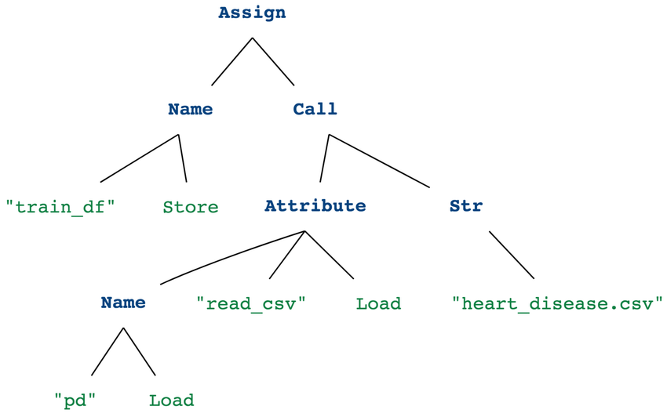
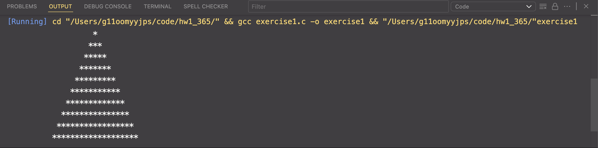

# Exercise 1 Homework ICS 365

### Do you have a favorite programming language?

- I really like using JavaScript. The reason is because of how flexible it is with lots of fun frameworks and libraries that it has. This language was the gateway for me to start my journey in pursing to create more web application developments. I also love the many courses and projects you can create with using JavaScript.

### What CPU/processor is used in your computer, and which instruction set architecture (ISA) should the C compiler target to ensure that the compiled code works properly on your machine?

- My processor for my Mac is Apple M2 Max. ISA to target is _arm64-apple-darwin24.6.0_
- The compiler reads C code, and then turns it into a internal representation (LLVM IR for Apple Clang) and then optimize it. Once it is optimized,the backend emits ARM64 machine instructions and uses macOS ABI specific to Apple M2 which is for registers, convention, etc. Then, the object files are link to a Mach-O exe the M2 processors can run.

**Steps on what the compiler performs**

1. Parse C into a build syntax tree (Abstract Syntax Tree)
   
2. Lower AST -> LLVM IR
3. Optimize internal representation (IR) such as inlining, constant folding, loop optimizations, etc
4. Backend maps IR for ARM64 instructions, allocate registers, schedules instructions for Apple M2
5. Emit object (Mach-O) and link to create a executable that follows macOS runtime expectations.

### How did you find the ISA used for your CPU?

- I can find the chip type by going to _About this mac_ and see that the chip is _Apple M2 Max_. I also ran the command line in my terminal `uname -m` to get the output of
  _arm64_. To find the default target, I also ran the command line, `
clang -v` and got an output of:

  ```
  Apple clang version 15.0.0 (clang-1500.3.9.4)
  Target: arm64-apple-darwin24.6.0
  Thread model: posix
  InstalledDir: /Library/Developer/CommandLineTools/usr/bin
  ```

### Execution screenshot of Pyramid program



### Github Account Link:

[JSirisavath](https://github.com/JSirisavath)
